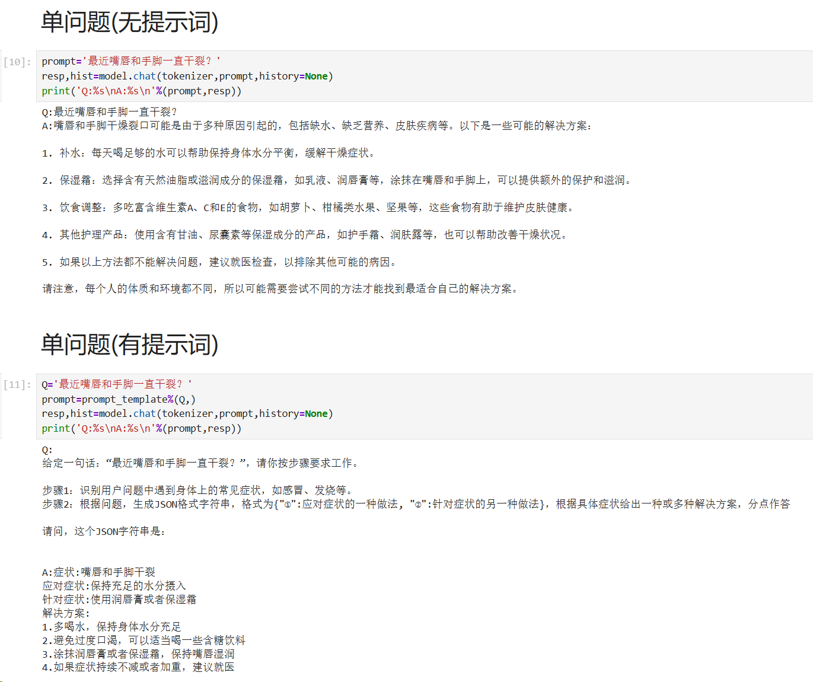

# 千问大模型微调 - 医疗领域的QA
<p align="center">
    
<p>

## 项目结构


本项目基于千问大模型 `Qwen-1.8B-Chat-Int4` 进行微调，部分自定义的文件如下：
```
├── medical.ipynb       代码文件
├── medical.txt         网上找的一些普通病状的QA
└── medical_train.txt   梳理好的训练文件
```

## 微调前后结果

训练环境有限（4070笔记本电脑，只有8G显存...），所以没办法训练出好结果，不过还是能看出有点区别的



## 微调过程

纯小白，之前没怎么接触大模型，最近试着配了下本地环境痛苦得要死，熬夜搞了三天才弄好，特此记录一下，免得到时重新配环境时又不知道当时怎么做出来的...

我最开始跟着网上的教程做，用的wsl-ubuntu下的环境，后来发现有点下载模型该配置什么的有点麻烦，然后又转回windows环境重新下载了工程，但是最后面需要执行一个shell脚本来执行微调训练时，发现在windows系统下无法运行，我小白又不会，网上搜不到解决方案，就又转到wsl-ubuntu的环境下来了(后知后觉当时这个环境装的pytorch好像不是linux的命令，所以得重新再配一个环境)

项目搭建全过程如下，其中一些通用的配置（wsl2 + ubuntu的安装等）我就跳过了，我这里列举一些我遇到的众多奇葩报错，而且网上很难搜得到解决方案的那种问题

## 基础环境搭建

`wsl2 + ubuntu22.04`、`cuda11.8`、`cudnn8.9.7 11.x`、`python3.8`

首先创建虚拟环境（最好先安装一个anaconda）：`conda create -n QwenEnv python==3.8 -y `

然后先装一下pytorch：`pip3 install torch torchvision torchaudio --index-url https://download.pytorch.org/whl/cu118` （不先装的话，后面默认下载的话没cuda的东西，应该默认装的cpu版本）

## 模型选择

我用的是千问的大模型，由于电脑配置有限，再加上只想试试最简单的功能，因此只下载了 `Qwen-1.8B-Chat-Int4` 这个比较小的模型

网址如下：https://hf-mirror.com/Qwen/Qwen-1_8B-Chat-Int4

## 报错合集

### hugging face连接不上

下载模型时，发现hugging face连接不上，然后试了下modelscope下载模型，刚开始不会，都不知道下载到哪里，所以我就去hf.mirror镜像官网手动下载一个个文件，拼成一个工程（因为没找到合适的git clone命令，点进去不知道为什么网址还是hugging face，连接不上所以不能clone），模型路径也不知道加载哪个，后来发现外层文件夹就是，又过了一段时间，才知道modelscope下载的模型保存到`/root/user(自己的用户名)/.cache/modelscope/hub/xxx`目录下，重新找了下试了能成功，其实可以不用手动一个个下载文件的...（真想抽自己两巴掌）
hugging face 镜像地址：https://hf-mirror.com/models

### 训练缺少其他依赖

在微调训练文件时，发现没deepspeed，还得安装pip install deepspeed，装好之后又报错：还得安装：pip install auto-gptq optimum（其实官方文档有说明但是我当时看的是博主在Qwen展示的文档，而不是在具体模型Qwen-1_8B-Chat-Int4下面的文档，因此缺少了依赖项的说明）

### wsl环境下的cuda安装不上

安装好后，发现还是有报错，突然想到，我wsl环境里面好像还没安装cuda+cudnn，但是我装的pytorch都是带cuda要求的，因此还得去找安装教程，其实按官方的linux指令依次执行即可，但是我执行到最后一句发现：一堆apt装不上，依赖关系还感觉很复杂

```
bzip2 : Depends: libbz2-1.0 (= 1.0.6-9.2~deb10u2) but 1.0.8-4 is to be installed
dpkg-dev : Depends: bzip2 but it is not installable  libc6-dev : Depends: libc6 (= 2.31-0ubuntu9.17) but 2.35-0ubuntu3.8 is to be installed
Depends: libc-dev-bin (= 2.31-0ubuntu9.17) but it is not going to be installed
```

找了许多帖子都说版本不对，但是这里apt一下，那里apt一下，一直有依赖冲突搞得我头快炸了，搞到凌晨一点多才发现有一篇帖子说得比较彻底一点，就是ubuntu不同版本的镜像代号是不一样的，我的ubuntu是22.04版本，代号jammy，但是我找了下我的阿里云镜像源，里面还是20版本的代号，需要修改配置文件后才能apt其他包
具体解决方法大家可以看这篇博客：https://blog.csdn.net/lishuaigell/article/details/124740342?spm=1001.2014.3001.5502
我参考博客的过程中，发现又有一个错误：`sudo: gedit: command not found`，直接pip 安装又不行，最后用的nano编辑器来修改镜像源文件

后续还要安装cudnn，具体cuda+cudnn的教程我参考的是下面这个：

### json无法解析

训练发现json无法解析，有单引号双引号啥的问题（Expecting property name enclosed in double quotes: ），也是搞了一两个小时才好，有点忘了当时的解决方案，只记得是多打了空格还是什么，总之应该不是什么特别大的错误，但是报错的地方挺难找，弄了好久才发现


后面训练还是报错如下：

### Accelerator.__init__() got an unexpected keyword argument ‘dispatch_batches‘

网上找的答案是版本不对，要重新装：`pip install accelerate==0.28.0`，结果还是不对，找了报错的地方发现accelerate初始化的地方根本没有`dispatch_batches`这个属性，然后我继续找教程，发现版本要改到1.3.0，然后初始化的配置重新改，发现又有报错：没有属性`split_batches`，为了避免其他错误发生，只好重新下载回0.28.0版本，最后实在没办法，根本就没有`dispatch_batches`这个属性，干脆把它删了！然后这里是没问题了，但是下面其他地方又有...

### ModuleNotFoundError: No module named 'mpi4py'

刚开始试了直接`pip install mpi4py`，结果报错构建错误，没有找到`python.h`，后来又试了`conda install mpi4py`，结果没找到torchaudio=0.12.1，可是我torchaudio明明已经安装了而且还是比较高的版本，很奇怪，所以放弃了conda安装，继续想想pip安装的方法
之后继续上网找了下，先装好依赖`sudo apt install mpich`，然后再`sudo apt-get update`，再`pip install mpi4py`，发现还是不行，最后问了下kimi，结合多次试验，最终确定了还要在输入一条命令：`sudo apt-get install python3-dev`，成功解决了找不到python.h的问题，然后再`pip install mpi4py`，成功安装

后面应该就没啥问题了，微调训练可以跑起来，注意`batch_size`不要太高（因为我爆显存了...）

此外还有很多零零散散的报错，如`ModuleNotFoundError: No module named 'modelscope'`，有点记不清了，不过那些记不清的报错应该都是比较小的问题，大问题就是上面这些，我解决一个平均都要花1小时以上，前前后后搞了将近3天才搞好(┬┬﹏┬┬)，现在把错误做个合集分享出来，不知道有没有想做大模型微调Demo的小伙伴，这一堆报错的解决方案或许会给你带来帮助！